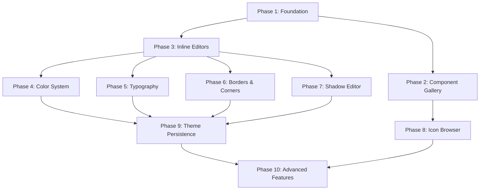

# Design System Tool - Implementation Phases

> **Project Goal**: Create an internal design system tool for the SaaS Leave Management System that allows developers to view components, edit theme tokens, and browse icons with inline editing capabilities similar to Subframe.

## Overview

This document outlines the phased implementation approach for building the design system tool. The implementation is divided into 10 strategic phases, each building upon the previous ones to ensure a working tool at every milestone.

---

## **Phase 1: Foundation & Basic Structure** 
**Timeline**: Week 1  
**Priority**: High  
**Goal**: Set up the basic infrastructure and navigation

### Tasks:
1. **Install dependencies**
   ```bash
   pnpm add react-colorful @lucide/react cmdk
   ```

2. **Create directory structure**
   ```
   app/(internal)/theme-editor/
   ├── page.tsx
   ├── layout.tsx
   ├── theme/page.tsx
   ├── icons/page.tsx
   └── components/
       ├── sidebar-nav.tsx
       ├── overview/
       ├── theme/
       ├── icons/
       └── editors/
   ```

3. **Implement core layout components**
   - `layout.tsx` with sidebar navigation
   - `sidebar-nav.tsx` with active state routing
   - Basic page shells for all three sections

4. **Set up access control**
   - Middleware protection for `/theme-editor` routes
   - Basic authentication check via cookies
   - Redirect protection for unauthorized users

### Deliverable
✅ Working navigation between Overview, Theme, and Icons sections  
✅ Protected route structure  
✅ Basic layout foundation

---

## **Phase 2: Component Gallery & Overview**
**Timeline**: Week 1-2  
**Priority**: High  
**Goal**: Create the component showcase functionality

### Tasks:
1. **Build ComponentGrid**
   - Display all existing shadcn/ui components
   - Categorize by type (Actions, Form, Layout, Display, Feedback)
   - Responsive grid layout with hover effects

2. **Component preview system**
   - Live rendering of actual components with realistic props
   - Interactive hover states and transitions
   - Category-based organization

3. **Component catalog**
   - Button variants (primary, outline, ghost)
   - Form elements (Input, Select, Checkbox, Switch, Textarea)
   - Layout components (Card, Separator)
   - Display components (Badge, Avatar, Alert)
   - Feedback components (Progress, Skeleton)

### Deliverable
✅ Complete component gallery at `/theme-editor`  
✅ Live component previews  
✅ Responsive grid layout

---

## **Phase 3: Basic Inline Editors**
**Timeline**: Week 2  
**Priority**: High  
**Goal**: Create reusable editing components

### Tasks:
1. **InlineColorPicker component**
   - `react-colorful` HexColorPicker integration
   - Popover wrapper with proper positioning
   - Size variants (sm: 12x12, md: 20x20, lg: 24x24)
   - Manual hex input with validation
   - Color swatch display with labels

2. **InlineNumberInput component**
   - Controlled number input with validation
   - Min/max/step constraints
   - Suffix support (px, %, em, rem, etc.)
   - Label support for better UX
   - Focus and blur state management

3. **Base styling and interactions**
   - Consistent focus states with ring styling
   - Smooth hover transitions
   - Accessibility features (ARIA labels, keyboard navigation)
   - Error state handling

### Deliverable
✅ Working inline editor components ready for theme editing  
✅ Consistent styling and interactions  
✅ Proper TypeScript interfaces

---

## **Phase 4: Color System**
**Timeline**: Week 3  
**Priority**: High  
**Goal**: Complete color token management

### Tasks:
1. **ColorTokens component**
   - Brand colors (50-900 shades)
   - Neutral colors (50-900 shades)
   - Semantic colors (error, warning, success)
   - Organized color group display
   - Live color editing with immediate preview

2. **Color state management**
   - React state for all color values
   - Nested object structure for color groups
   - Real-time updates without page refresh
   - Color validation and error handling

3. **Visual feedback system**
   - Large color swatch display
   - Hex value labels
   - Organized grid layout by color group
   - Visual hierarchy with proper spacing

### Deliverable
✅ Complete color editing system at `/theme-editor/theme`  
✅ Live color preview and editing  
✅ Professional color palette management

---

## **Phase 5: Typography System**
**Timeline**: Week 3-4  
**Priority**: High  
**Goal**: Typography token management

### Tasks:
1. **Typography component**
   - 8 predefined text styles:
     - Display (48px, 700 weight)
     - Heading 1-3 (32px, 24px, 20px)
     - Body Large, Body, Body Bold (16px, 14px, 14px)
     - Caption (12px)
   - Live preview with actual sample text
   - Font weight, size, and line-height display

2. **Typography information system**
   - Side-by-side preview and specifications
   - Hover interactions for enhanced UX
   - Clear visual hierarchy
   - Font upload button (UI placeholder)

3. **Typography controls**
   - Font family selection (future enhancement)
   - Weight adjustment (future enhancement)
   - Line height modification (future enhancement)

### Deliverable
✅ Typography showcase and information system  
✅ Live text style previews  
✅ Comprehensive typography documentation

---

## **Phase 6: Border & Corner Systems**
**Timeline**: Week 4  
**Priority**: High  
**Goal**: Complete border and corner radius management

### Tasks:
1. **Borders component**
   - Primary and neutral border style presets
   - Width editing (0-10px range)
   - Style selection (solid, dashed, dotted)
   - Color editing with InlineColorPicker
   - Live preview boxes with actual border rendering

2. **Corners component**
   - 5 border radius presets:
     - None (0px)
     - Small (4px)
     - Medium (8px)
     - Large (16px)
     - XL (24px)
   - Live preview with rounded boxes
   - Inline number editing for custom values
   - Visual radius demonstration

### Deliverable
✅ Complete border editing system  
✅ Corner radius management  
✅ Live preview for all border properties

---

## **Phase 7: Advanced Shadow Editor**
**Timeline**: Week 5  
**Priority**: Medium  
**Goal**: Multi-layer shadow editing system

### Tasks:
1. **Shadow layer management**
   - Multiple shadow layers per preset
   - Add/remove layer functionality
   - X, Y offset controls (-50 to +50px)
   - Blur radius (0-100px)
   - Spread radius (-50 to +50px)
   - Opacity control (0-100%)

2. **Shadow preview system**
   - Real-time CSS box-shadow generation
   - Live preview boxes with white background
   - Multiple shadow presets (Small, Medium, Large)
   - Visual shadow demonstration

3. **Advanced layer interactions**
   - Layer reordering (future enhancement)
   - Duplicate layer functionality
   - Complex shadow combinations
   - CSS export for shadow values

### Deliverable
✅ Professional-grade shadow editing system  
✅ Multi-layer shadow support  
✅ Real-time shadow preview

---

## **Phase 8: Icon Browser**
**Timeline**: Week 5-6  
**Priority**: Medium  
**Goal**: Complete icon management system

### Tasks:
1. **IconGrid component**
   - Full Lucide React library integration
   - Filter out non-icon exports
   - Responsive grid layout (6-12 columns based on screen size)
   - Icon count display

2. **Search and filtering**
   - Real-time search functionality
   - Case-insensitive filtering
   - Search result count display
   - Fast rendering with proper key management

3. **Icon interactions**
   - Click to copy import statement to clipboard
   - Visual feedback on successful copy (green highlight)
   - 2-second timeout for feedback reset
   - Icon name display with truncation
   - Hover effects for better UX

### Deliverable
✅ Complete icon browser at `/theme-editor/icons`  
✅ Search and copy functionality  
✅ Professional icon gallery interface

---

## **Phase 9: Theme Persistence**
**Timeline**: Week 6-7  
**Priority**: Medium  
**Goal**: Save and load theme configurations

### Tasks:
1. **Supabase integration**
   - Create `design_themes` table
   - CRUD operations for theme configurations
   - User-specific theme storage
   - Organization-level theme sharing

2. **Export functionality**
   - Generate CSS custom properties
   - Export Tailwind config object
   - JSON configuration export
   - Copy to clipboard functionality

3. **Theme preset system**
   - Save current theme as named preset
   - Load predefined theme configurations
   - Theme versioning and history
   - Reset to default theme option

### Deliverable
✅ Persistent theme management system  
✅ Export functionality for developers  
✅ Theme preset and versioning

---

## **Phase 10: Advanced Features**
**Timeline**: Week 7-8  
**Priority**: Low  
**Goal**: Polish and advanced functionality

### Tasks:
1. **Enhanced editing features**
   - Gradient editor for advanced backgrounds
   - Animation preset management
   - Spacing system editor (padding, margin)
   - Advanced typography controls

2. **Team collaboration features**
   - Theme sharing between team members
   - Approval workflows for theme changes
   - Change history and diff viewing
   - Comments and feedback system

3. **Developer productivity tools**
   - CSS variable generation with proper naming
   - Component code export with applied themes
   - Design token documentation generator
   - Integration with existing build process

### Deliverable
✅ Production-ready design system tool  
✅ Team collaboration features  
✅ Advanced developer productivity tools

---

## Implementation Strategy

### Priority Levels
- **High Priority (Phases 1-6)**: Essential functionality for basic design system management
- **Medium Priority (Phases 7-8)**: Advanced features that enhance the tool significantly
- **Low Priority (Phases 9-10)**: Polish features and team collaboration tools

### Dependencies


### Weekly Milestones
- **Week 1**: Foundation + Component Gallery (Phases 1-2)
- **Week 2**: Inline Editors (Phase 3)
- **Week 3**: Color + Typography Systems (Phases 4-5)
- **Week 4**: Borders + Corners (Phase 6)
- **Week 5**: Shadow Editor (Phase 7)
- **Week 6**: Icon Browser (Phase 8)
- **Week 7**: Theme Persistence (Phase 9)
- **Week 8**: Advanced Features (Phase 10)

### Success Criteria
- ✅ Working tool available after Phase 2
- ✅ Complete design token editing after Phase 6
- ✅ Full feature parity with professional tools after Phase 8
- ✅ Production-ready system after Phase 10

---

## Technical Notes

### Required Dependencies
```json
{
  "react-colorful": "^5.6.1",
  "@lucide/react": "^0.263.1",
  "cmdk": "^0.2.0"
}
```

### Integration Points
- Built on existing Next.js 15.3.3 + TypeScript + Tailwind CSS stack
- Uses existing shadcn/ui component library
- Integrates with current Supabase setup for persistence
- Follows existing authentication and middleware patterns

### Performance Considerations
- Lazy loading for icon grid
- Debounced search for better performance
- Optimized re-rendering with React.memo where needed
- Efficient state management to prevent unnecessary updates

---

*This phased approach ensures you have a working design system tool early while building toward the complete vision systematically. Each phase delivers tangible value and can be used immediately by the development team.* 